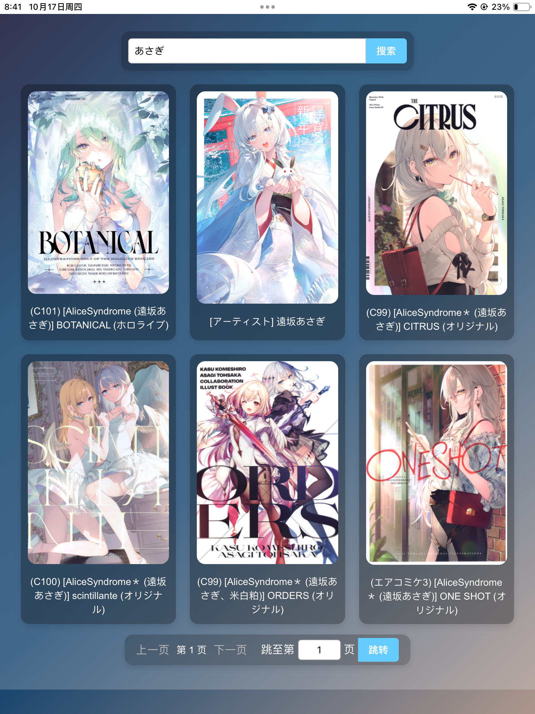

# 漫画/图片 web阅读器

**这是使用AI写的一个非常简单的漫画阅读器 Web 应用程序，使用 Flask 构建。**
截止2天前，楼主没有看过1秒钟编程视频，代码编辑器用的还是记事本，纯靠gpt老师
（AI主要用的是 4O 和 copilot，claude3.5，极少数 o1）

## 截图



## 安装

1. 克隆此仓库：
   ```
   git clone https://github.com/ikemenrourou/manga-viewer.git
   cd manga-viewer
   ```

2. 安装依赖：
   ```
   pip install -r requirements.txt
   ```


## 使用方法

0.修改config.ini文件，comics_folder = 填入存放漫画/图片文件的文件夹路径，例如 D:\Comics 或 P:\漫画（注意=后面有空格）

1. 运行应用程序：
   ```
   python app.py
   ```

2. 打开浏览器，访问 `http://localhost:5000`

3. 其他设备访问http://你的运行程序的局域网IP地址:5000（例如http://192.168.1.10:5000）

## 注意事项

- 确保 `config.ini` 中的漫画文件夹路径正确设置
- 漫画文件夹应包含子文件夹，每个子文件夹代表一部漫画，其中包含漫画图片
- 支持常见图片格式（如 JPG、PNG）

欢迎提交 Pull Requests 来改进这个项目。对于重大更改，请先开 issue 讨论您想要改变的内容。

## 技术栈

- Python 3
- Flask
- Waitress (WSGI 服务器)
- HTML/CSS

